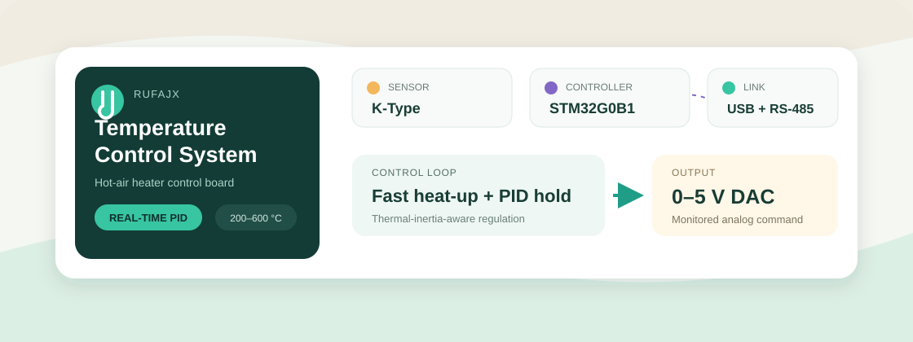

# Rufajx Hot-Air Temperature Controller

**Industrial temperature acquisition, predictive control, and monitored 0–5 V command output.**

[简体中文](README.zh-CN.md) · [System](Docs/README.md) · [Hardware](Docs/HARDWARE.md) · [Pinout](Docs/PINOUT.md) · [PCB](Docs/PCB_DESIGN.md) · [Firmware](Docs/FIRMWARE_GUIDE.md)

## Purpose

This board was developed for Rufajx to control the heating temperature of an industrial hot-air machine. It reads an insulated-junction K-type thermocouple, runs a thermal-inertia-aware state machine with predictive PI/PID control, and sends a calibrated 0–5 V command to the machine controller.

The board is a measurement and command controller. It does not directly regulate heater power through P2. P4 is a separate normally closed relay contact in a hazardous 220 VAC path.

## Current Hardware Baseline

| Function | Implementation |
|---|---|
| Controller | STM32G0B1CBT6N, LQFP-48 |
| Temperature input | MAX6675 plus insulated/ungrounded-junction K-type probe |
| Analog command | PA4 DAC1_OUT1, 2.5 V VREFBUF, TLV9351 gain stage, 0–5 V at P2 |
| Output verification | PA0 ADC feedback sampled after the P2 series resistor |
| Service interface | USB 2.0 Type-C for ROM DFU and planned USB CDC |
| Field communication | THVD1400DR non-isolated half-duplex RS-485 at P5 |
| Programming/debug | 5-pin SWD header, BOOT, and RESET |
| Safety contact | 24 V coil, normally closed 220 VAC relay contact at P4 |
| Supply | Protected nominal 24 V input plus USB/24 V low-voltage source OR-ing |
| Process target | Approximately 200–600 °C |

RS-485 P5 uses pin 1 = B and pin 2 = A. The interface is non-isolated and assumes a verified common ground elsewhere in the machine. The 120 Ω R22 termination must be fitted only when this board is one of the two selected electrical ends of the bus; a passive multi-branch network must not terminate every branch endpoint.

## External Connections

| Connector | Pin 1 | Pin 2 | Function |
|---|---|---|---|
| P1 | K+ | K- | Insulated K-type thermocouple |
| P2 | GND | 0–5V OUT | Monitored heating command |
| P3 | GND | +24V | Machine control supply |
| P4 | NC (L) | COM (L) | Hazardous 220 VAC normally closed contact |
| P5 | B | A | Two-wire half-duplex RS-485 |

H1 provides GND, 3V3/VTref, NRST, SWCLK/BOOT0, and SWDIO.

## Documentation

- [Project and system overview](Docs/README.md)
- [Hardware reference](Docs/HARDWARE.md)
- [MCU and connector pinout](Docs/PINOUT.md)
- [PCB design and manufacturing notes](Docs/PCB_DESIGN.md)
- [Firmware development guide](Docs/FIRMWARE_GUIDE.md)
- [Production-readiness actions](Docs/PCB_REQUIRED_FIXES.md)

## Repository Layout

- `PCB Design/`: editable EasyEDA project
- `Docs/`: hardware, pinout, PCB, firmware, and release documentation
- `.github/assets/`: repository presentation assets

Firmware source has not yet been added. The documented production baseline is VS Code + PlatformIO + STM32Cube HAL/LL, with SWD for development and ROM USB DFU for recovery.

## Release Status

The latest PCB passes strict EasyEDA DRC under the configured rules. This does not prove mains isolation, EMC performance, analog accuracy, relay lifetime, or complete machine safety.

The board is **not approved for 220 VAC production release** in its current layout. The closest measured hazardous-mains-to-SELV separations are below the project's conservative 8 mm target, and the current rules do not enforce a complete mains isolation barrier. RS-485 termination/topology, ESD return paths, analog calibration, real-load behavior, first-article testing, EMC testing, and independent overtemperature protection also require recorded validation.

See [PCB_REQUIRED_FIXES.md](Docs/PCB_REQUIRED_FIXES.md) before ordering a production batch.

## Safety

- 200–600 °C is the controlled process range, not the permitted PCB ambient temperature.
- Sensor, reference, DAC, ADC-feedback, watchdog, and timing faults must force the analog command to 0 V.
- Loss of board power leaves the normally closed P4 contact closed.
- The complete machine requires independent overtemperature protection and a suitably rated power-interruption path.
- Do not connect mains during ordinary bench bring-up.

## Ownership

Developed for **Rufajx** as a custom industrial hot-air temperature-control system. All rights are reserved unless the project owner publishes separate licensing terms.
